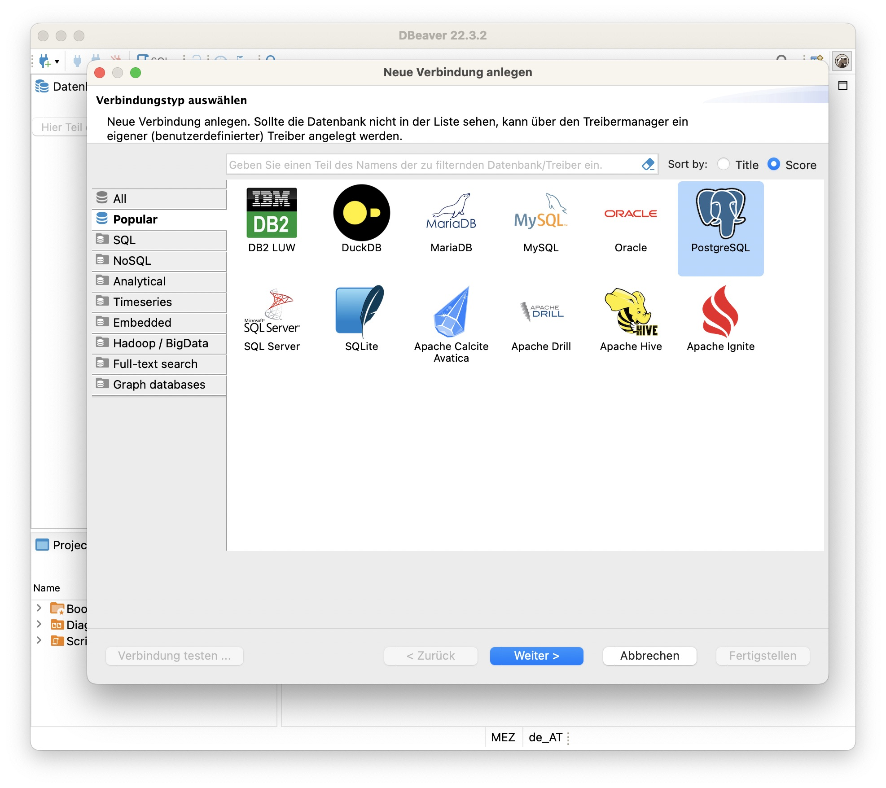
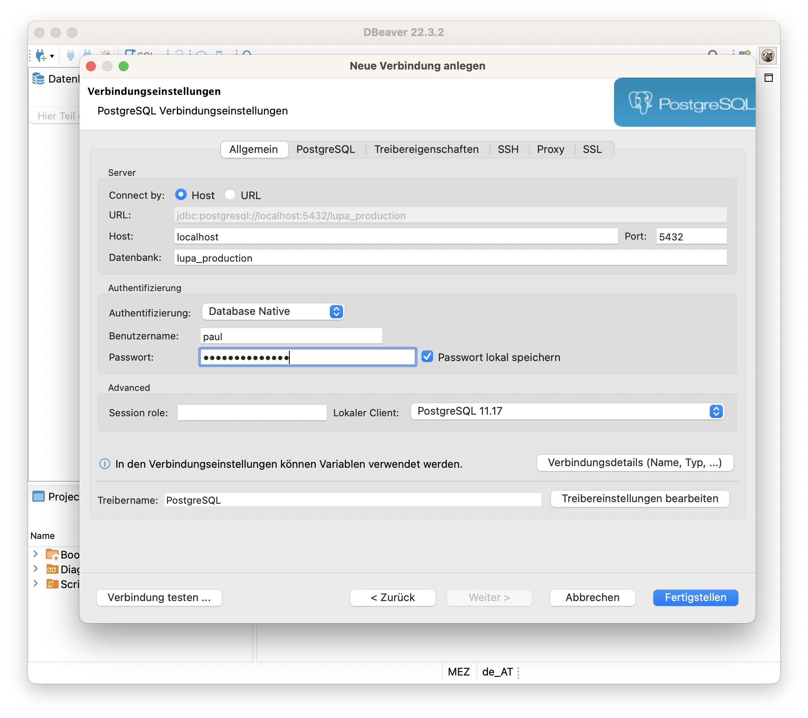
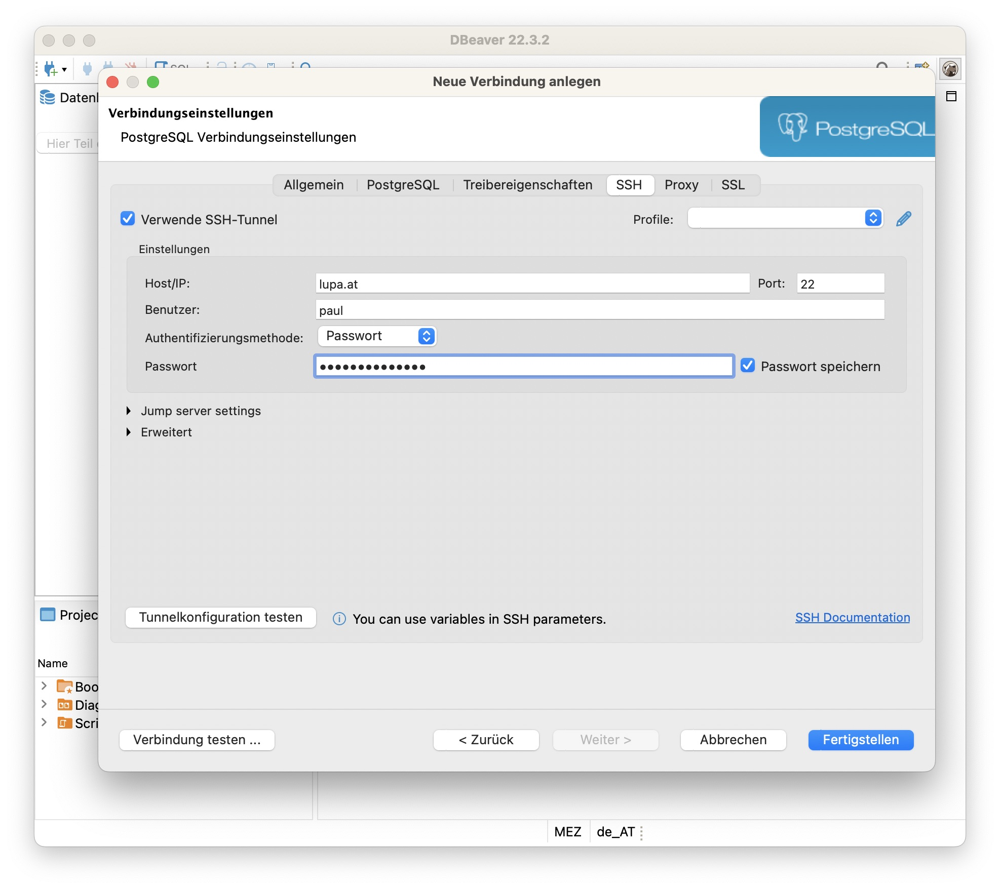
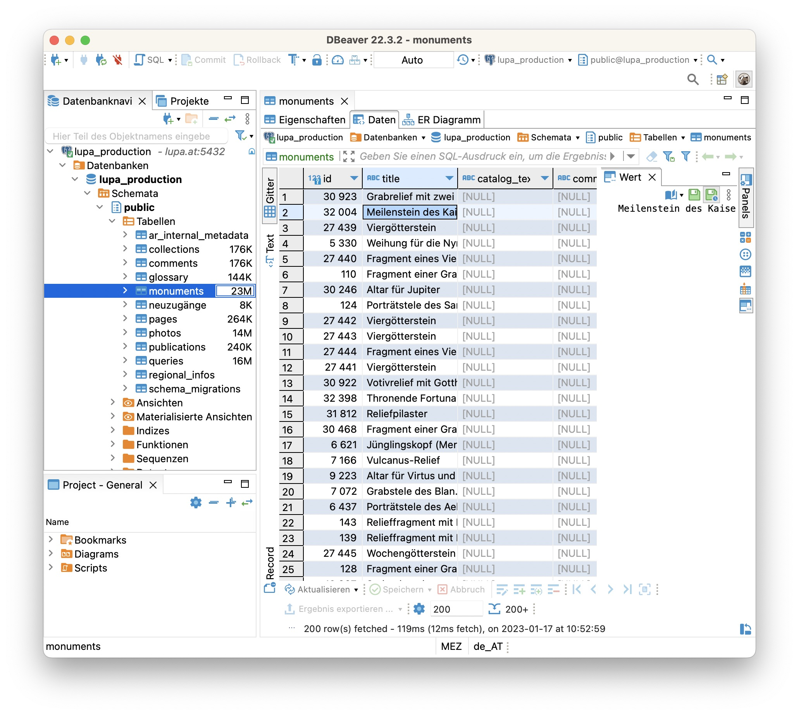

# Dateneingabe mit DBeaver

DBeaver ist ein PostgreSQL-Client für macOS, Windows und Linux.

Auf dieser Seite beschreiben wir, wie du mit DBeaver Daten in die Lupa-Datenbank eingeben kannst.

## Verbindungseinstellungen

1. Lade die Community Edition von der [DBeaver Download Seite](https://dbeaver.io/download/)
2. Beim ersten starten fragt DBeaver ob du eine Datenbank erstellen willst -> Nein
3. Füge eine Verbindung zum PostgreSQL Server hinzu. Klicke falls notwendig auf das Icon links oben (Stecker mit Plus)
4. Wähle PostgreSQL (blauer Elephant)
   
5. Fülle zuerst die Felder im Reiter **Allgemein** aus:
   - **Datenbank:** lupa_production
   - **Benutzername:** *dein Benutzername*
   - **Passwort:** *dein Passwort*
   
6. Wechsle dann auf den Reiter **SSH**:
   - **Verwende SSH-Tunnel**: Ja
   - **Host/IP:** lupa.at
   - Benutzer: *nocheinmal dein Benutzername*
   - Passwort: *nocheinmal dein Passwort*
   
7. Überprüfe ob alles funktioniert mit dem Button "Verbindung testen…" (links unten). Wahrscheinlich müssen beim ersten Mal noch Treiber geladen werden.
8. Wenn alles funktiniert, klicke "Fertigstellen"
9. Nun findest du die neue Verbindung in der Seitenleiste. Um zu den Steindenkmälern zu gelangen, folge diesem Pfad in der Seitenleiste:
   - lupa_production
     - Datenbanken
       - lupa_production
         - Schemata
           - public
             - Tabellen
               - monuments
10. Wechsle in den Reiter "Daten" um den Inhalt der Tabelle anzuzeigen
    
