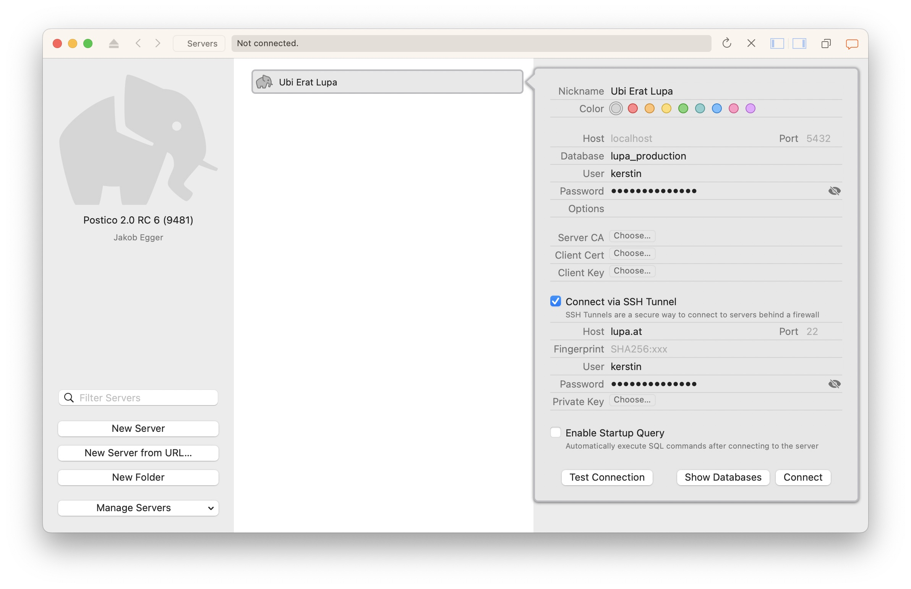

# Dateneingabe mit Postico

Wenn du einen Mac hast, empfehle ich Postico zur Dateneingabe.

## Verbindungseinstellungen

1. Gehe zur [Postico Webseite](https://eggerapps.at/postico/) und lade die neueste Version
2. Gib folgende Verbindungseinstellungen ein:
   - **Database:** lupa_production
   - **User:** *dein Benutzername*
   - **Passwort:** *dein Passwort*
   - **Connect via SSH Tunnel:** Ja
   - **Host:** lupa.at
   - **Fingerprint:** SHA256:TuLAFXYhglgQ5+caR2xX08iwJM+XEsdM+mUzEYlKyag
   - **User:** *nocheinmal dein Benutzername*
   - **Passwort:** *nocheinmal dein Passwort*
   
3. Klicke auf "Test Connection" um die Verbindung zu überprüfen.
4. Wenn keine Fehlermeldung kommt, kannst du danach auf "Connect" klicken.
